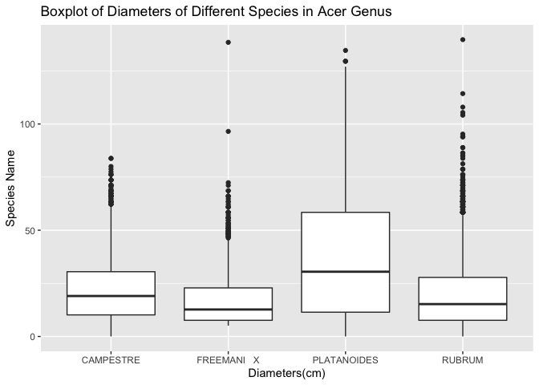
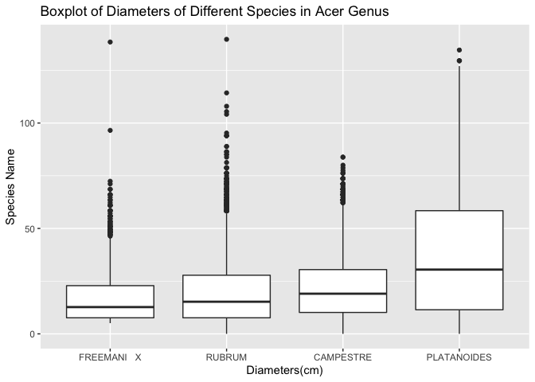

Mini Data Analysis Milestone 2
================

*To complete this milestone, you can edit [this `.rmd`
file](https://raw.githubusercontent.com/UBC-STAT/stat545.stat.ubc.ca/master/content/mini-project/mini-project-2.Rmd)
directly. Fill in the sections that are commented out with
`<!--- start your work here--->`. When you are done, make sure to knit
to an `.md` file by changing the output in the YAML header to
`github_document`, before submitting a tagged release on canvas.*

# Welcome to your second (and last) milestone in your mini data analysis project!

In Milestone 1, you explored your data, came up with research questions,
and obtained some results by making summary tables and graphs. This
time, we will first explore more in depth the concept of *tidy data.*
Then, you’ll be sharpening some of the results you obtained from your
previous milestone by:

- Manipulating special data types in R: factors and/or dates and times.
- Fitting a model object to your data, and extract a result.
- Reading and writing data as separate files.

**NOTE**: The main purpose of the mini data analysis is to integrate
what you learn in class in an analysis. Although each milestone provides
a framework for you to conduct your analysis, it’s possible that you
might find the instructions too rigid for your data set. If this is the
case, you may deviate from the instructions – just make sure you’re
demonstrating a wide range of tools and techniques taught in this class.

# Instructions

**To complete this milestone**, edit [this very `.Rmd`
file](https://raw.githubusercontent.com/UBC-STAT/stat545.stat.ubc.ca/master/content/mini-project/mini-project-2.Rmd)
directly. Fill in the sections that are tagged with
`<!--- start your work here--->`.

**To submit this milestone**, make sure to knit this `.Rmd` file to an
`.md` file by changing the YAML output settings from
`output: html_document` to `output: github_document`. Commit and push
all of your work to your mini-analysis GitHub repository, and tag a
release on GitHub. Then, submit a link to your tagged release on canvas.

**Points**: This milestone is worth 55 points (compared to the 45 points
of the Milestone 1): 45 for your analysis, and 10 for your entire
mini-analysis GitHub repository. Details follow.

**Research Questions**: In Milestone 1, you chose two research questions
to focus on. Wherever realistic, your work in this milestone should
relate to these research questions whenever we ask for justification
behind your work. In the case that some tasks in this milestone don’t
align well with one of your research questions, feel free to discuss
your results in the context of a different research question.

# Learning Objectives

By the end of this milestone, you should:

- Understand what *tidy* data is, and how to create it using `tidyr`.
- Generate a reproducible and clear report using R Markdown.
- Manipulating special data types in R: factors and/or dates and times.
- Fitting a model object to your data, and extract a result.
- Reading and writing data as separate files.

# Setup

Begin by loading your data and the tidyverse package below:

``` r
library(datateachr)
library(tidyverse)
library(ggplot2)
library(dplyr)
library(infer)
library(broom)
library(tsibble)
library(here)
```

# Task 1: Tidy your data (15 points)

In this task, we will do several exercises to reshape our data. The goal
here is to understand how to do this reshaping with the `tidyr` package.

A reminder of the definition of *tidy* data:

- Each row is an **observation**
- Each column is a **variable**
- Each cell is a **value**

*Tidy’ing* data is sometimes necessary because it can simplify
computation. Other times it can be nice to organize data so that it can
be easier to understand when read manually.

### 2.1 (2.5 points)

Based on the definition above, can you identify if your data is tidy or
untidy? Go through all your columns, or if you have \>8 variables, just
pick 8, and explain whether the data is untidy or tidy.

<!--------------------------- Start your work below --------------------------->

``` r
head(vancouver_trees)
```

    ## # A tibble: 6 × 20
    ##   tree_id civic_number std_str…¹ genus…² speci…³ culti…⁴ commo…⁵ assig…⁶ root_…⁷
    ##     <dbl>        <dbl> <chr>     <chr>   <chr>   <chr>   <chr>   <chr>   <chr>  
    ## 1  149556          494 W 58TH AV ULMUS   AMERIC… BRANDON BRANDO… N       N      
    ## 2  149563          450 W 58TH AV ZELKOVA SERRATA <NA>    JAPANE… N       N      
    ## 3  149579         4994 WINDSOR … STYRAX  JAPONI… <NA>    JAPANE… N       N      
    ## 4  149590          858 E 39TH AV FRAXIN… AMERIC… AUTUMN… AUTUMN… Y       N      
    ## 5  149604         5032 WINDSOR … ACER    CAMPES… <NA>    HEDGE … N       N      
    ## 6  149616          585 W 61ST AV PYRUS   CALLER… CHANTI… CHANTI… N       N      
    ## # … with 11 more variables: plant_area <chr>, on_street_block <dbl>,
    ## #   on_street <chr>, neighbourhood_name <chr>, street_side_name <chr>,
    ## #   height_range_id <dbl>, diameter <dbl>, curb <chr>, date_planted <date>,
    ## #   longitude <dbl>, latitude <dbl>, and abbreviated variable names
    ## #   ¹​std_street, ²​genus_name, ³​species_name, ⁴​cultivar_name, ⁵​common_name,
    ## #   ⁶​assigned, ⁷​root_barrier

``` r
vancouver_trees <- vancouver_trees %>%
  mutate(diameter_cm = diameter *2.54) 
vancouver_trees_subset<-vancouver_trees %>%
  select(tree_id, genus_name, diameter_cm, species_name, on_street, neighbourhood_name,   date_planted, height_range_id)
vancouver_trees_subset
```

    ## # A tibble: 146,611 × 8
    ##    tree_id genus_name diameter_cm species_n…¹ on_st…² neigh…³ date_pla…⁴ heigh…⁵
    ##      <dbl> <chr>            <dbl> <chr>       <chr>   <chr>   <date>       <dbl>
    ##  1  149556 ULMUS             25.4 AMERICANA   W 58TH… MARPOLE 1999-01-13       2
    ##  2  149563 ZELKOVA           25.4 SERRATA     W 58TH… MARPOLE 1996-05-31       4
    ##  3  149579 STYRAX            10.2 JAPONICA    WINDSO… KENSIN… 1993-11-22       3
    ##  4  149590 FRAXINUS          45.7 AMERICANA   E 39TH… KENSIN… 1996-04-29       4
    ##  5  149604 ACER              22.9 CAMPESTRE   WINDSO… KENSIN… 1993-12-17       2
    ##  6  149616 PYRUS             12.7 CALLERYANA  W 61ST… MARPOLE NA               2
    ##  7  149617 ACER              38.1 PLATANOIDES SHERBR… KENSIN… 1993-12-16       3
    ##  8  149618 ACER              35.6 PLATANOIDES SHERBR… KENSIN… 1993-12-16       3
    ##  9  149619 ACER              40.6 PLATANOIDES SHERBR… KENSIN… 1993-12-16       2
    ## 10  149625 FRAXINUS          19.0 AMERICANA   E 39TH… KENSIN… 1993-12-03       2
    ## # … with 146,601 more rows, and abbreviated variable names ¹​species_name,
    ## #   ²​on_street, ³​neighbourhood_name, ⁴​date_planted, ⁵​height_range_id

I choose the vancouver_trees dataset. I first select the variables
related to my research question which are genus_name and diameter_cm and
then put the rest randomly. The dataset is tidy since each row is an
observation, each column is a variable, and each cell is a value.
<!----------------------------------------------------------------------------->

### 2.2 (5 points)

Now, if your data is tidy, untidy it! Then, tidy it back to it’s
original state.

If your data is untidy, then tidy it! Then, untidy it back to it’s
original state.

Be sure to explain your reasoning for this task. Show us the “before”
and “after”.

<!--------------------------- Start your work below --------------------------->

``` r
# untidy
vancouver_trees_subset_untidy <- vancouver_trees_subset %>%
  pivot_wider(names_from = genus_name,
              values_from = diameter_cm)
vancouver_trees_subset_untidy
```

    ## # A tibble: 146,611 × 103
    ##    tree_id species_name on_str…¹ neigh…² date_pla…³ heigh…⁴ ULMUS ZELKOVA STYRAX
    ##      <dbl> <chr>        <chr>    <chr>   <date>       <dbl> <dbl>   <dbl>  <dbl>
    ##  1  149556 AMERICANA    W 58TH … MARPOLE 1999-01-13       2  25.4    NA     NA  
    ##  2  149563 SERRATA      W 58TH … MARPOLE 1996-05-31       4  NA      25.4   NA  
    ##  3  149579 JAPONICA     WINDSOR… KENSIN… 1993-11-22       3  NA      NA     10.2
    ##  4  149590 AMERICANA    E 39TH … KENSIN… 1996-04-29       4  NA      NA     NA  
    ##  5  149604 CAMPESTRE    WINDSOR… KENSIN… 1993-12-17       2  NA      NA     NA  
    ##  6  149616 CALLERYANA   W 61ST … MARPOLE NA               2  NA      NA     NA  
    ##  7  149617 PLATANOIDES  SHERBRO… KENSIN… 1993-12-16       3  NA      NA     NA  
    ##  8  149618 PLATANOIDES  SHERBRO… KENSIN… 1993-12-16       3  NA      NA     NA  
    ##  9  149619 PLATANOIDES  SHERBRO… KENSIN… 1993-12-16       2  NA      NA     NA  
    ## 10  149625 AMERICANA    E 39TH … KENSIN… 1993-12-03       2  NA      NA     NA  
    ## # … with 146,601 more rows, 94 more variables: FRAXINUS <dbl>, ACER <dbl>,
    ## #   PYRUS <dbl>, TILIA <dbl>, HIBISCUS <dbl>, LIQUIDAMBAR <dbl>, PRUNUS <dbl>,
    ## #   CARPINUS <dbl>, QUERCUS <dbl>, CRATAEGUS <dbl>, ROBINIA <dbl>,
    ## #   PARROTIA <dbl>, CORNUS <dbl>, MAGNOLIA <dbl>, CATALPA <dbl>, FAGUS <dbl>,
    ## #   GLEDITSIA <dbl>, CHAMAECYPARIS <dbl>, SORBUS <dbl>, POPULUS <dbl>,
    ## #   CERCIDIPHYLLUM <dbl>, AESCULUS <dbl>, THUJA <dbl>, NOTHOFAGUS <dbl>,
    ## #   MALUS <dbl>, PINUS <dbl>, ABIES <dbl>, SALIX <dbl>, GYMNOCLADUS <dbl>, …

``` r
#convert back
vancouver_trees_subset_tidy <- vancouver_trees_subset_untidy %>%
  pivot_longer(cols = c(ULMUS:ALBIZIA),
               names_to = "genus_name",
               values_to = "diameter_cm",
               values_drop_na = TRUE) %>%
  select(tree_id, genus_name, diameter_cm, everything())
vancouver_trees_subset_tidy
```

    ## # A tibble: 146,611 × 8
    ##    tree_id genus_name diameter_cm species_n…¹ on_st…² neigh…³ date_pla…⁴ heigh…⁵
    ##      <dbl> <chr>            <dbl> <chr>       <chr>   <chr>   <date>       <dbl>
    ##  1  149556 ULMUS             25.4 AMERICANA   W 58TH… MARPOLE 1999-01-13       2
    ##  2  149563 ZELKOVA           25.4 SERRATA     W 58TH… MARPOLE 1996-05-31       4
    ##  3  149579 STYRAX            10.2 JAPONICA    WINDSO… KENSIN… 1993-11-22       3
    ##  4  149590 FRAXINUS          45.7 AMERICANA   E 39TH… KENSIN… 1996-04-29       4
    ##  5  149604 ACER              22.9 CAMPESTRE   WINDSO… KENSIN… 1993-12-17       2
    ##  6  149616 PYRUS             12.7 CALLERYANA  W 61ST… MARPOLE NA               2
    ##  7  149617 ACER              38.1 PLATANOIDES SHERBR… KENSIN… 1993-12-16       3
    ##  8  149618 ACER              35.6 PLATANOIDES SHERBR… KENSIN… 1993-12-16       3
    ##  9  149619 ACER              40.6 PLATANOIDES SHERBR… KENSIN… 1993-12-16       2
    ## 10  149625 FRAXINUS          19.0 AMERICANA   E 39TH… KENSIN… 1993-12-03       2
    ## # … with 146,601 more rows, and abbreviated variable names ¹​species_name,
    ## #   ²​on_street, ³​neighbourhood_name, ⁴​date_planted, ⁵​height_range_id

I first untidy the dataset using pivot_wider(), which creates many
columns about the types of tree and creates many NA cells. Then I use
pivot_longer() to tidy the dataset to its original state.
<!----------------------------------------------------------------------------->

### 2.3 (7.5 points)

Now, you should be more familiar with your data, and also have made
progress in answering your research questions. Based on your interest,
and your analyses, pick 2 of the 4 research questions to continue your
analysis in the next four tasks:

<!-------------------------- Start your work below ---------------------------->

1.  In milestone 1: Does the genus of a tree affect its diameter?
    Updated: Does the species of a tree affect its diameter?
2.  In milestone 1: What is the most planted tree (genus) in Vancouver?
    Updated: What is the most planted tree (species) in Vancouver?

<!----------------------------------------------------------------------------->

Explain your decision for choosing the above two research questions.

<!--------------------------- Start your work below --------------------------->

In the previous milestone, I realized that there exited a huge
difference between different genera of trees, so now I am going to focus
on thee different species in the same genus to see if there is any
difference.
<!----------------------------------------------------------------------------->

Now, try to choose a version of your data that you think will be
appropriate to answer these 2 questions. Use between 4 and 8 functions
that we’ve covered so far (i.e. by filtering, cleaning, tidy’ing,
dropping irrelevant columns, etc.).

<!--------------------------- Start your work below --------------------------->

``` r
# For research question 1, I choose the acer genus since acer is the most planted tree in Vancouver.
acer_count <- vancouver_trees %>%
  filter(genus_name == "ACER") %>%
  group_by(species_name) %>%
  summarize(count = n()) %>%
  arrange(desc(count)) %>%
  mutate(planted_level = case_when(count < 50 ~ "very less",
                                   count < 100 ~ "less",
                                   count < 500 ~ "moderate",
                                   count < 3000 ~ "high",
                                   count < 15000 ~ "very high"))
acer_count
```

    ## # A tibble: 31 × 3
    ##    species_name   count planted_level
    ##    <chr>          <int> <chr>        
    ##  1 PLATANOIDES    11963 very high    
    ##  2 RUBRUM          8467 very high    
    ##  3 FREEMANI   X    4164 very high    
    ##  4 CAMPESTRE       3477 very high    
    ##  5 PSEUDOPLATANUS  2091 high         
    ##  6 TRUNCATUM       1918 high         
    ##  7 PALMATUM        1037 high         
    ##  8 GRISEUM          510 high         
    ##  9 CAPPADOCICUM     417 moderate     
    ## 10 MACROPHYLLUM     398 moderate     
    ## # … with 21 more rows

``` r
# Since there are more than 30 species, I only select the planted_level with high

acer_selected <- vancouver_trees %>%
  filter(species_name %in% c("PLATANOIDES", "RUBRUM", "CAMPESTRE") | agrepl("FREEMANI X", species_name), diameter_cm < 200) %>%
  select(species_name, diameter_cm)
acer_selected
```

    ## # A tibble: 28,067 × 2
    ##    species_name diameter_cm
    ##    <chr>              <dbl>
    ##  1 CAMPESTRE           22.9
    ##  2 PLATANOIDES         38.1
    ##  3 PLATANOIDES         35.6
    ##  4 PLATANOIDES         40.6
    ##  5 PLATANOIDES         45.7
    ##  6 CAMPESTRE           26.0
    ##  7 PLATANOIDES         49.5
    ##  8 PLATANOIDES         35.6
    ##  9 CAMPESTRE           24.8
    ## 10 PLATANOIDES         34.3
    ## # … with 28,057 more rows

``` r
acer_selected_boxplot <- acer_selected %>%
  ggplot(aes(x = species_name, y = diameter_cm), color = species_name) +
  geom_boxplot() +
  ggtitle("Boxplot of Diameters of Different Species in Acer Genus") +
  xlab("Diameters(cm)") +
  ylab("Species Name")
acer_selected_boxplot
```

<!-- -->

By looking at the box plot above, I can see that the diameter varies
among the different species in the acer genus.

``` r
# Question 2
species_count <- vancouver_trees %>%
  group_by(species_name) %>%
  summarize(count = n()) %>%
  arrange(desc(count))
species_count
```

    ## # A tibble: 283 × 2
    ##    species_name count
    ##    <chr>        <int>
    ##  1 SERRULATA    13357
    ##  2 CERASIFERA   12031
    ##  3 PLATANOIDES  11963
    ##  4 RUBRUM        8467
    ##  5 AMERICANA     5515
    ##  6 SYLVATICA     5285
    ##  7 BETULUS       5195
    ##  8 EUCHLORA   X  4427
    ##  9 FREEMANI   X  4164
    ## 10 CAMPESTRE     3477
    ## # … with 273 more rows

The most planted species in Vancouver is SERRULATA.
<!----------------------------------------------------------------------------->

# Task 2: Special Data Types (10)

For this exercise, you’ll be choosing two of the three tasks below –
both tasks that you choose are worth 5 points each.

But first, tasks 1 and 2 below ask you to modify a plot you made in a
previous milestone. The plot you choose should involve plotting across
at least three groups (whether by facetting, or using an aesthetic like
colour). Place this plot below (you’re allowed to modify the plot if
you’d like). If you don’t have such a plot, you’ll need to make one.
Place the code for your plot below.

<!-------------------------- Start your work below ---------------------------->

``` r
acer_selected <- vancouver_trees %>%
  filter(species_name %in% c("PLATANOIDES", "RUBRUM", "CAMPESTRE") | agrepl("FREEMANI X", species_name), diameter_cm < 200) %>%
  select(species_name, diameter_cm)
acer_selected
```

    ## # A tibble: 28,067 × 2
    ##    species_name diameter_cm
    ##    <chr>              <dbl>
    ##  1 CAMPESTRE           22.9
    ##  2 PLATANOIDES         38.1
    ##  3 PLATANOIDES         35.6
    ##  4 PLATANOIDES         40.6
    ##  5 PLATANOIDES         45.7
    ##  6 CAMPESTRE           26.0
    ##  7 PLATANOIDES         49.5
    ##  8 PLATANOIDES         35.6
    ##  9 CAMPESTRE           24.8
    ## 10 PLATANOIDES         34.3
    ## # … with 28,057 more rows

``` r
acer_selected_boxplot <- acer_selected %>%
  ggplot(aes(x = species_name, y = diameter_cm), color = species_name) +
  geom_boxplot() +
  ggtitle("Boxplot of Diameters of Different Species in Acer Genus") +
  xlab("Diameters(cm)") +
  ylab("Species Name")
acer_selected_boxplot
```

<!-- -->
<!----------------------------------------------------------------------------->

Now, choose two of the following tasks.

1.  Produce a new plot that reorders a factor in your original plot,
    using the `forcats` package (3 points). Then, in a sentence or two,
    briefly explain why you chose this ordering (1 point here for
    demonstrating understanding of the reordering, and 1 point for
    demonstrating some justification for the reordering, which could be
    subtle or speculative.)

2.  Produce a new plot that groups some factor levels together into an
    “other” category (or something similar), using the `forcats` package
    (3 points). Then, in a sentence or two, briefly explain why you
    chose this grouping (1 point here for demonstrating understanding of
    the grouping, and 1 point for demonstrating some justification for
    the grouping, which could be subtle or speculative.)

3.  If your data has some sort of time-based column like a date (but
    something more granular than just a year):

    1.  Make a new column that uses a function from the `lubridate` or
        `tsibble` package to modify your original time-based column. (3
        points)

        - Note that you might first have to *make* a time-based column
          using a function like `ymd()`, but this doesn’t count.
        - Examples of something you might do here: extract the day of
          the year from a date, or extract the weekday, or let 24 hours
          elapse on your dates.

    2.  Then, in a sentence or two, explain how your new column might be
        useful in exploring a research question. (1 point for
        demonstrating understanding of the function you used, and 1
        point for your justification, which could be subtle or
        speculative).

        - For example, you could say something like “Investigating the
          day of the week might be insightful because penguins don’t
          work on weekends, and so may respond differently”.

<!-------------------------- Start your work below ---------------------------->

**Task Number**: 1

``` r
acer_selectet_reorder <- vancouver_trees %>%
  filter(species_name %in% c("PLATANOIDES", "RUBRUM", "CAMPESTRE") | agrepl("FREEMANI X", species_name), diameter_cm < 200) %>%
  select(species_name, diameter_cm) %>%
  mutate(species_name = fct_reorder(species_name, diameter_cm))
acer_selectet_reorder
```

    ## # A tibble: 28,067 × 2
    ##    species_name diameter_cm
    ##    <fct>              <dbl>
    ##  1 CAMPESTRE           22.9
    ##  2 PLATANOIDES         38.1
    ##  3 PLATANOIDES         35.6
    ##  4 PLATANOIDES         40.6
    ##  5 PLATANOIDES         45.7
    ##  6 CAMPESTRE           26.0
    ##  7 PLATANOIDES         49.5
    ##  8 PLATANOIDES         35.6
    ##  9 CAMPESTRE           24.8
    ## 10 PLATANOIDES         34.3
    ## # … with 28,057 more rows

``` r
acer_selected_boxplot <- acer_selectet_reorder %>%
  ggplot(aes(x = species_name, y = diameter_cm), color = species_name) +
  geom_boxplot() +
  ggtitle("Boxplot of Diameters of Different Species in Acer Genus") +
  xlab("Diameters(cm)") +
  ylab("Species Name")
acer_selected_boxplot
```

<!-- -->

In the original plot, the levels of column diameters_cm are randomly
ordered, so I use fct_order() to create a data frame with an increasing
order of the average value of diameters_cm.

<!----------------------------------------------------------------------------->
<!-------------------------- Start your work below ---------------------------->

**Task Number**: 3

``` r
vancouver_trees_subset <- vancouver_trees_subset %>%
  mutate(quarter = yearquarter(date_planted))
vancouver_trees_subset
```

    ## # A tibble: 146,611 × 9
    ##    tree_id genus_name diame…¹ speci…² on_st…³ neigh…⁴ date_pla…⁵ heigh…⁶ quarter
    ##      <dbl> <chr>        <dbl> <chr>   <chr>   <chr>   <date>       <dbl>   <qtr>
    ##  1  149556 ULMUS         25.4 AMERIC… W 58TH… MARPOLE 1999-01-13       2 1999 Q1
    ##  2  149563 ZELKOVA       25.4 SERRATA W 58TH… MARPOLE 1996-05-31       4 1996 Q2
    ##  3  149579 STYRAX        10.2 JAPONI… WINDSO… KENSIN… 1993-11-22       3 1993 Q4
    ##  4  149590 FRAXINUS      45.7 AMERIC… E 39TH… KENSIN… 1996-04-29       4 1996 Q2
    ##  5  149604 ACER          22.9 CAMPES… WINDSO… KENSIN… 1993-12-17       2 1993 Q4
    ##  6  149616 PYRUS         12.7 CALLER… W 61ST… MARPOLE NA               2      NA
    ##  7  149617 ACER          38.1 PLATAN… SHERBR… KENSIN… 1993-12-16       3 1993 Q4
    ##  8  149618 ACER          35.6 PLATAN… SHERBR… KENSIN… 1993-12-16       3 1993 Q4
    ##  9  149619 ACER          40.6 PLATAN… SHERBR… KENSIN… 1993-12-16       2 1993 Q4
    ## 10  149625 FRAXINUS      19.0 AMERIC… E 39TH… KENSIN… 1993-12-03       2 1993 Q4
    ## # … with 146,601 more rows, and abbreviated variable names ¹​diameter_cm,
    ## #   ²​species_name, ³​on_street, ⁴​neighbourhood_name, ⁵​date_planted,
    ## #   ⁶​height_range_id

I use yearquarter() function to create a new column that stores the
quarter when a tree is planted. It is useful since I can investigate if
season matters for planting trees. For this kind of question, I don’t
think a specific day is a good idea.
<!----------------------------------------------------------------------------->

# Task 3: Modelling

## 2.0 (no points)

Pick a research question, and pick a variable of interest (we’ll call it
“Y”) that’s relevant to the research question. Indicate these.

<!-------------------------- Start your work below ---------------------------->

**Research Question**: If there is statistically association between the
species of tree and its diameter? Null hypothesis: The diameters of
different species in same genus are independent. Alternative: The
diameters of different species in same genus are dependent.

**Variable of interest**: diameter_cm

<!----------------------------------------------------------------------------->

## 2.1 (5 points)

Fit a model or run a hypothesis test that provides insight on this
variable with respect to the research question. Store the model object
as a variable, and print its output to screen. We’ll omit having to
justify your choice, because we don’t expect you to know about model
specifics in STAT 545.

- **Note**: It’s OK if you don’t know how these models/tests work. Here
  are some examples of things you can do here, but the sky’s the limit.

  - You could fit a model that makes predictions on Y using another
    variable, by using the `lm()` function.
  - You could test whether the mean of Y equals 0 using `t.test()`, or
    maybe the mean across two groups are different using `t.test()`, or
    maybe the mean across multiple groups are different using `anova()`
    (you may have to pivot your data for the latter two).
  - You could use `lm()` to test for significance of regression.

<!-------------------------- Start your work below ---------------------------->

``` r
SLR_species_name <- lm(diameter_cm ~ species_name, acer_selected)
SLR_species_name
```

    ## 
    ## Call:
    ## lm(formula = diameter_cm ~ species_name, data = acer_selected)
    ## 
    ## Coefficients:
    ##              (Intercept)  species_nameFREEMANI   X   species_namePLATANOIDES  
    ##                   22.591                    -5.755                    13.150  
    ##       species_nameRUBRUM  
    ##                   -3.133

<!----------------------------------------------------------------------------->

## 2.2 (5 points)

Produce something relevant from your fitted model: either predictions on
Y, or a single value like a regression coefficient or a p-value.

- Be sure to indicate in writing what you chose to produce.
- Your code should either output a tibble (in which case you should
  indicate the column that contains the thing you’re looking for), or
  the thing you’re looking for itself.
- Obtain your results using the `broom` package if possible. If your
  model is not compatible with the broom function you’re needing, then
  you can obtain your results by some other means, but first indicate
  which broom function is not compatible.

<!-------------------------- Start your work below ---------------------------->

``` r
slr_results <-tidy(SLR_species_name) %>%
  mutate_if(is.numeric, round, 2)
slr_results
```

    ## # A tibble: 4 × 5
    ##   term                     estimate std.error statistic p.value
    ##   <chr>                       <dbl>     <dbl>     <dbl>   <dbl>
    ## 1 (Intercept)                 22.6       0.33     68.6        0
    ## 2 species_nameFREEMANI   X    -5.76      0.45    -12.9        0
    ## 3 species_namePLATANOIDES     13.2       0.37     35.2        0
    ## 4 species_nameRUBRUM          -3.13      0.39     -8.01       0

I use tidy() to obtain the estimated coefficients, associated standard
errors, t-statistic and p value. Based on the simple linear regression
result above, we reject the null hypothesis. Thus, the diameters of a
tree is statistically associated with the type of species in the same
genus.
<!----------------------------------------------------------------------------->

# Task 4: Reading and writing data

Get set up for this exercise by making a folder called `output` in the
top level of your project folder / repository. You’ll be saving things
there.

## 3.1 (5 points)

Take a summary table that you made from Milestone 1 (Task 4.2), and
write it as a csv file in your `output` folder. Use the `here::here()`
function.

- **Robustness criteria**: You should be able to move your Mini Project
  repository / project folder to some other location on your computer,
  or move this very Rmd file to another location within your project
  repository / folder, and your code should still work.
- **Reproducibility criteria**: You should be able to delete the csv
  file, and remake it simply by knitting this Rmd file.

<!-------------------------- Start your work below ---------------------------->

``` r
tree_narrow <- vancouver_trees %>%
  filter(genus_name %in% c("PYRUS","ACER","STYRAX"), diameter_cm != 0)
tree_narrow_summary <- 
  tree_narrow %>%
  select(genus_name, diameter_cm) %>%
  group_by(genus_name) %>%
  summarize(mean_diam = mean(diameter_cm),
            median_diam = median(diameter_cm),
            sd_diam = sd(diameter_cm),
            range_diam = range(diameter_cm))
```

    ## `summarise()` has grouped output by 'genus_name'. You can override using the
    ## `.groups` argument.

``` r
table<- data.frame(tree_narrow_summary)

dir.create(here::here("Milestone2_data"))
write_csv(table, here("Milestone2_data", "exported_table.csv"))
```

<!----------------------------------------------------------------------------->

## 3.2 (5 points)

Write your model object from Task 3 to an R binary file (an RDS), and
load it again. Be sure to save the binary file in your `output` folder.
Use the functions `saveRDS()` and `readRDS()`.

- The same robustness and reproducibility criteria as in 3.1 apply here.

<!-------------------------- Start your work below ---------------------------->

``` r
saveRDS(SLR_species_name, here("Milestone2_data", "slr_species.RDS"))
slr_read<-readRDS(here("Milestone2_data","slr_species.RDS"))
slr_read
```

    ## 
    ## Call:
    ## lm(formula = diameter_cm ~ species_name, data = acer_selected)
    ## 
    ## Coefficients:
    ##              (Intercept)  species_nameFREEMANI   X   species_namePLATANOIDES  
    ##                   22.591                    -5.755                    13.150  
    ##       species_nameRUBRUM  
    ##                   -3.133

<!----------------------------------------------------------------------------->

# Tidy Repository

Now that this is your last milestone, your entire project repository
should be organized. Here are the criteria we’re looking for.

## Main README (3 points)

There should be a file named `README.md` at the top level of your
repository. Its contents should automatically appear when you visit the
repository on GitHub.

Minimum contents of the README file:

- In a sentence or two, explains what this repository is, so that
  future-you or someone else stumbling on your repository can be
  oriented to the repository.
- In a sentence or two (or more??), briefly explains how to engage with
  the repository. You can assume the person reading knows the material
  from STAT 545A. Basically, if a visitor to your repository wants to
  explore your project, what should they know?

Once you get in the habit of making README files, and seeing more README
files in other projects, you’ll wonder how you ever got by without them!
They are tremendously helpful.

## File and Folder structure (3 points)

You should have at least four folders in the top level of your
repository: one for each milestone, and one output folder. If there are
any other folders, these are explained in the main README.

Each milestone document is contained in its respective folder, and
nowhere else.

Every level-1 folder (that is, the ones stored in the top level, like
“Milestone1” and “output”) has a `README` file, explaining in a sentence
or two what is in the folder, in plain language (it’s enough to say
something like “This folder contains the source for Milestone 1”).

## Output (2 points)

All output is recent and relevant:

- All Rmd files have been `knit`ted to their output, and all data files
  saved from Task 4 above appear in the `output` folder.
- All of these output files are up-to-date – that is, they haven’t
  fallen behind after the source (Rmd) files have been updated.
- There should be no relic output files. For example, if you were
  knitting an Rmd to html, but then changed the output to be only a
  markdown file, then the html file is a relic and should be deleted.

Our recommendation: delete all output files, and re-knit each
milestone’s Rmd file, so that everything is up to date and relevant.

PS: there’s a way where you can run all project code using a single
command, instead of clicking “knit” three times. More on this in STAT
545B!

## Error-free code (1 point)

This Milestone 1 document knits error-free, and the Milestone 2 document
knits error-free.

## Tagged release (1 point)

You’ve tagged a release for Milestone 1, and you’ve tagged a release for
Milestone 2.

### Attribution

Thanks to Victor Yuan for mostly putting this together.
