Mini Data-Analysis Deliverable 1
================

# Welcome to your (maybe) first-ever data analysis project!

And hopefully the first of many. Let’s get started:

1.  Install the [`datateachr`](https://github.com/UBC-MDS/datateachr)
    package by typing the following into your **R terminal**:

<!-- -->

    install.packages("devtools")
    devtools::install_github("UBC-MDS/datateachr")

2.  Load the packages below.

``` r
library(datateachr)
library(tidyverse)
```

    ## ── Attaching packages ─────────────────────────────────────── tidyverse 1.3.2 ──
    ## ✔ ggplot2 3.3.6      ✔ purrr   0.3.4 
    ## ✔ tibble  3.1.8      ✔ dplyr   1.0.10
    ## ✔ tidyr   1.2.1      ✔ stringr 1.4.1 
    ## ✔ readr   2.1.2      ✔ forcats 0.5.2 
    ## ── Conflicts ────────────────────────────────────────── tidyverse_conflicts() ──
    ## ✖ dplyr::filter() masks stats::filter()
    ## ✖ dplyr::lag()    masks stats::lag()

``` r
library(ggplot2)
library(dplyr)
library(infer)
```

3.  Make a repository in the <https://github.com/stat545ubc-2022>
    Organization. You will be working with this repository for the
    entire data analysis project. You can either make it public, or make
    it private and add the TA’s and Lucy as collaborators. A link to
    help you create a private repository is available on the
    \#collaborative-project Slack channel.

# Instructions

## For Both Milestones

- Each milestone is worth 45 points. The number of points allocated to
  each task will be annotated within each deliverable. Tasks that are
  more challenging will often be allocated more points.

- 10 points will be allocated to the reproducibility, cleanliness, and
  coherence of the overall analysis. While the two milestones will be
  submitted as independent deliverables, the analysis itself is a
  continuum - think of it as two chapters to a story. Each chapter, or
  in this case, portion of your analysis, should be easily followed
  through by someone unfamiliar with the content.
  [Here](https://swcarpentry.github.io/r-novice-inflammation/06-best-practices-R/)
  is a good resource for what constitutes “good code”. Learning good
  coding practices early in your career will save you hassle later on!

## For Milestone 1

**To complete this milestone**, edit [this very `.Rmd`
file](https://raw.githubusercontent.com/UBC-STAT/stat545.stat.ubc.ca/master/content/mini-project/mini-project-1.Rmd)
directly. Fill in the sections that are tagged with
`<!--- start your work below --->`.

**To submit this milestone**, make sure to knit this `.Rmd` file to an
`.md` file by changing the YAML output settings from
`output: html_document` to `output: github_document`. Commit and push
all of your work to the mini-analysis GitHub repository you made
earlier, and tag a release on GitHub. Then, submit a link to your tagged
release on canvas.

**Points**: This milestone is worth 45 points: 43 for your analysis, 1
point for having your Milestone 1 document knit error-free, and 1 point
for tagging your release on Github.

# Learning Objectives

By the end of this milestone, you should:

- Become familiar with your dataset of choosing
- Select 4 questions that you would like to answer with your data
- Generate a reproducible and clear report using R Markdown
- Become familiar with manipulating and summarizing your data in tibbles
  using `dplyr`, with a research question in mind.

# Task 1: Choose your favorite dataset (10 points)

The `datateachr` package by Hayley Boyce and Jordan Bourak currently
composed of 7 semi-tidy datasets for educational purposes. Here is a
brief description of each dataset:

- *apt_buildings*: Acquired courtesy of The City of Toronto’s Open Data
  Portal. It currently has 3455 rows and 37 columns.

- *building_permits*: Acquired courtesy of The City of Vancouver’s Open
  Data Portal. It currently has 20680 rows and 14 columns.

- *cancer_sample*: Acquired courtesy of UCI Machine Learning Repository.
  It currently has 569 rows and 32 columns.

- *flow_sample*: Acquired courtesy of The Government of Canada’s
  Historical Hydrometric Database. It currently has 218 rows and 7
  columns.

- *parking_meters*: Acquired courtesy of The City of Vancouver’s Open
  Data Portal. It currently has 10032 rows and 22 columns.

- *steam_games*: Acquired courtesy of Kaggle. It currently has 40833
  rows and 21 columns.

- *vancouver_trees*: Acquired courtesy of The City of Vancouver’s Open
  Data Portal. It currently has 146611 rows and 20 columns.

**Things to keep in mind**

- We hope that this project will serve as practice for carrying our your
  own *independent* data analysis. Remember to comment your code, be
  explicit about what you are doing, and write notes in this markdown
  document when you feel that context is required. As you advance in the
  project, prompts and hints to do this will be diminished - it’ll be up
  to you!

- Before choosing a dataset, you should always keep in mind **your
  goal**, or in other ways, *what you wish to achieve with this data*.
  This mini data-analysis project focuses on *data wrangling*,
  *tidying*, and *visualization*. In short, it’s a way for you to get
  your feet wet with exploring data on your own.

And that is exactly the first thing that you will do!

1.1 Out of the 7 datasets available in the `datateachr` package, choose
**4** that appeal to you based on their description. Write your choices
below:

**Note**: We encourage you to use the ones in the `datateachr` package,
but if you have a dataset that you’d really like to use, you can include
it here. But, please check with a member of the teaching team to see
whether the dataset is of appropriate complexity. Also, include a
**brief** description of the dataset here to help the teaching team
understand your data.

<!-------------------------- Start your work below ---------------------------->

1: parking_meters  
2: vancouver_trees  
3: building_permits  
4: flow_sample

<!----------------------------------------------------------------------------->

1.2 One way to narrowing down your selection is to *explore* the
datasets. Use your knowledge of dplyr to find out at least *3*
attributes about each of these datasets (an attribute is something such
as number of rows, variables, class type…). The goal here is to have an
idea of *what the data looks like*.

*Hint:* This is one of those times when you should think about the
cleanliness of your analysis. I added a single code chunk for you below,
but do you want to use more than one? Would you like to write more
comments outside of the code chunk?

<!-------------------------- Start your work below ---------------------------->

``` r
### EXPLORE HERE ###
# Parking_meters
glimpse(parking_meters)
```

    ## Rows: 10,032
    ## Columns: 22
    ## $ meter_head     <chr> "Twin", "Pay Station", "Twin", "Single", "Twin", "Twin"…
    ## $ r_mf_9a_6p     <chr> "$2.00", "$1.00", "$1.00", "$1.00", "$2.00", "$2.00", "…
    ## $ r_mf_6p_10     <chr> "$4.00", "$1.00", "$1.00", "$1.00", "$1.00", "$1.00", "…
    ## $ r_sa_9a_6p     <chr> "$2.00", "$1.00", "$1.00", "$1.00", "$2.00", "$2.00", "…
    ## $ r_sa_6p_10     <chr> "$4.00", "$1.00", "$1.00", "$1.00", "$1.00", "$1.00", "…
    ## $ r_su_9a_6p     <chr> "$2.00", "$1.00", "$1.00", "$1.00", "$2.00", "$2.00", "…
    ## $ r_su_6p_10     <chr> "$4.00", "$1.00", "$1.00", "$1.00", "$1.00", "$1.00", "…
    ## $ rate_misc      <chr> NA, "$ .50", NA, NA, NA, NA, NA, NA, NA, NA, NA, NA, NA…
    ## $ time_in_effect <chr> "METER IN EFFECT: 9:00 AM TO 10:00 PM", "METER IN EFFEC…
    ## $ t_mf_9a_6p     <chr> "2 Hr", "10 Hrs", "2 Hr", "2 Hr", "2 Hr", "3 Hr", "2 Hr…
    ## $ t_mf_6p_10     <chr> "4 Hr", "10 Hrs", "4 Hr", "4 Hr", "4 Hr", "4 Hr", "4 Hr…
    ## $ t_sa_9a_6p     <chr> "2 Hr", "10 Hrs", "2 Hr", "2 Hr", "2 Hr", "3 Hr", "2 Hr…
    ## $ t_sa_6p_10     <chr> "4 Hr", "10 Hrs", "4 Hr", "4 Hr", "4 Hr", "4 Hr", "4 Hr…
    ## $ t_su_9a_6p     <chr> "2 Hr", "10 Hrs", "2 Hr", "2 Hr", "2 Hr", "3 Hr", "2 Hr…
    ## $ t_su_6p_10     <chr> "4 Hr", "10 Hrs", "4 Hr", "4 Hr", "4 Hr", "4 Hr", "4 Hr…
    ## $ time_misc      <chr> NA, "No Time Limit", NA, NA, NA, NA, NA, NA, NA, NA, NA…
    ## $ credit_card    <chr> "No", "Yes", "No", "No", "No", "No", "No", "No", "No", …
    ## $ pay_phone      <chr> "66890", "59916", "57042", "57159", "51104", "60868", "…
    ## $ longitude      <dbl> -123.1289, -123.0982, -123.1013, -123.1862, -123.1278, …
    ## $ latitude       <dbl> 49.28690, 49.27215, 49.25468, 49.26341, 49.26354, 49.27…
    ## $ geo_local_area <chr> "West End", "Strathcona", "Riley Park", "West Point Gre…
    ## $ meter_id       <chr> "670805", "471405", "C80145", "D03704", "301023", "5913…

``` r
head(parking_meters)
```

    ## # A tibble: 6 × 22
    ##   meter_head  r_mf_9a_6p r_mf_…¹ r_sa_…² r_sa_…³ r_su_…⁴ r_su_…⁵ rate_…⁶ time_…⁷
    ##   <chr>       <chr>      <chr>   <chr>   <chr>   <chr>   <chr>   <chr>   <chr>  
    ## 1 Twin        $2.00      $4.00   $2.00   $4.00   $2.00   $4.00   <NA>    METER …
    ## 2 Pay Station $1.00      $1.00   $1.00   $1.00   $1.00   $1.00   $ .50   METER …
    ## 3 Twin        $1.00      $1.00   $1.00   $1.00   $1.00   $1.00   <NA>    METER …
    ## 4 Single      $1.00      $1.00   $1.00   $1.00   $1.00   $1.00   <NA>    METER …
    ## 5 Twin        $2.00      $1.00   $2.00   $1.00   $2.00   $1.00   <NA>    METER …
    ## 6 Twin        $2.00      $1.00   $2.00   $1.00   $2.00   $1.00   <NA>    METER …
    ## # … with 13 more variables: t_mf_9a_6p <chr>, t_mf_6p_10 <chr>,
    ## #   t_sa_9a_6p <chr>, t_sa_6p_10 <chr>, t_su_9a_6p <chr>, t_su_6p_10 <chr>,
    ## #   time_misc <chr>, credit_card <chr>, pay_phone <chr>, longitude <dbl>,
    ## #   latitude <dbl>, geo_local_area <chr>, meter_id <chr>, and abbreviated
    ## #   variable names ¹​r_mf_6p_10, ²​r_sa_9a_6p, ³​r_sa_6p_10, ⁴​r_su_9a_6p,
    ## #   ⁵​r_su_6p_10, ⁶​rate_misc, ⁷​time_in_effect

``` r
# Vancouver trees
glimpse(vancouver_trees)
```

    ## Rows: 146,611
    ## Columns: 20
    ## $ tree_id            <dbl> 149556, 149563, 149579, 149590, 149604, 149616, 149…
    ## $ civic_number       <dbl> 494, 450, 4994, 858, 5032, 585, 4909, 4925, 4969, 7…
    ## $ std_street         <chr> "W 58TH AV", "W 58TH AV", "WINDSOR ST", "E 39TH AV"…
    ## $ genus_name         <chr> "ULMUS", "ZELKOVA", "STYRAX", "FRAXINUS", "ACER", "…
    ## $ species_name       <chr> "AMERICANA", "SERRATA", "JAPONICA", "AMERICANA", "C…
    ## $ cultivar_name      <chr> "BRANDON", NA, NA, "AUTUMN APPLAUSE", NA, "CHANTICL…
    ## $ common_name        <chr> "BRANDON ELM", "JAPANESE ZELKOVA", "JAPANESE SNOWBE…
    ## $ assigned           <chr> "N", "N", "N", "Y", "N", "N", "N", "N", "N", "N", "…
    ## $ root_barrier       <chr> "N", "N", "N", "N", "N", "N", "N", "N", "N", "N", "…
    ## $ plant_area         <chr> "N", "N", "4", "4", "4", "B", "6", "6", "3", "3", "…
    ## $ on_street_block    <dbl> 400, 400, 4900, 800, 5000, 500, 4900, 4900, 4900, 7…
    ## $ on_street          <chr> "W 58TH AV", "W 58TH AV", "WINDSOR ST", "E 39TH AV"…
    ## $ neighbourhood_name <chr> "MARPOLE", "MARPOLE", "KENSINGTON-CEDAR COTTAGE", "…
    ## $ street_side_name   <chr> "EVEN", "EVEN", "EVEN", "EVEN", "EVEN", "ODD", "ODD…
    ## $ height_range_id    <dbl> 2, 4, 3, 4, 2, 2, 3, 3, 2, 2, 2, 5, 3, 2, 2, 2, 2, …
    ## $ diameter           <dbl> 10.00, 10.00, 4.00, 18.00, 9.00, 5.00, 15.00, 14.00…
    ## $ curb               <chr> "N", "N", "Y", "Y", "Y", "Y", "Y", "Y", "Y", "Y", "…
    ## $ date_planted       <date> 1999-01-13, 1996-05-31, 1993-11-22, 1996-04-29, 19…
    ## $ longitude          <dbl> -123.1161, -123.1147, -123.0846, -123.0870, -123.08…
    ## $ latitude           <dbl> 49.21776, 49.21776, 49.23938, 49.23469, 49.23894, 4…

``` r
head(vancouver_trees)
```

    ## # A tibble: 6 × 20
    ##   tree_id civic_number std_str…¹ genus…² speci…³ culti…⁴ commo…⁵ assig…⁶ root_…⁷
    ##     <dbl>        <dbl> <chr>     <chr>   <chr>   <chr>   <chr>   <chr>   <chr>  
    ## 1  149556          494 W 58TH AV ULMUS   AMERIC… BRANDON BRANDO… N       N      
    ## 2  149563          450 W 58TH AV ZELKOVA SERRATA <NA>    JAPANE… N       N      
    ## 3  149579         4994 WINDSOR … STYRAX  JAPONI… <NA>    JAPANE… N       N      
    ## 4  149590          858 E 39TH AV FRAXIN… AMERIC… AUTUMN… AUTUMN… Y       N      
    ## 5  149604         5032 WINDSOR … ACER    CAMPES… <NA>    HEDGE … N       N      
    ## 6  149616          585 W 61ST AV PYRUS   CALLER… CHANTI… CHANTI… N       N      
    ## # … with 11 more variables: plant_area <chr>, on_street_block <dbl>,
    ## #   on_street <chr>, neighbourhood_name <chr>, street_side_name <chr>,
    ## #   height_range_id <dbl>, diameter <dbl>, curb <chr>, date_planted <date>,
    ## #   longitude <dbl>, latitude <dbl>, and abbreviated variable names
    ## #   ¹​std_street, ²​genus_name, ³​species_name, ⁴​cultivar_name, ⁵​common_name,
    ## #   ⁶​assigned, ⁷​root_barrier

``` r
# Building permits
glimpse(building_permits)
```

    ## Rows: 20,680
    ## Columns: 14
    ## $ permit_number               <chr> "BP-2016-02248", "BU468090", "DB-2016-0445…
    ## $ issue_date                  <date> 2017-02-01, 2017-02-01, 2017-02-01, 2017-…
    ## $ project_value               <dbl> 0, 0, 35000, 15000, 181178, 0, 15000, 0, 6…
    ## $ type_of_work                <chr> "Salvage and Abatement", "New Building", "…
    ## $ address                     <chr> "4378 W 9TH AVENUE, Vancouver, BC V6R 2C7"…
    ## $ project_description         <chr> NA, NA, NA, NA, NA, NA, NA, NA, NA, NA, NA…
    ## $ building_contractor         <chr> NA, NA, NA, "Mercury Contracting Ltd", "08…
    ## $ building_contractor_address <chr> NA, NA, NA, "88 W PENDER ST  \r\nUnit 2069…
    ## $ applicant                   <chr> "Raffaele & Associates DBA: Raffaele and A…
    ## $ applicant_address           <chr> "2642 East Hastings\r\nVancouver, BC  V5K …
    ## $ property_use                <chr> "Dwelling Uses", "Dwelling Uses", "Dwellin…
    ## $ specific_use_category       <chr> "One-Family Dwelling", "Multiple Dwelling"…
    ## $ year                        <dbl> 2017, 2017, 2017, 2017, 2017, 2017, 2017, …
    ## $ bi_id                       <dbl> 524, 535, 539, 541, 543, 546, 547, 548, 54…

``` r
head(building_permits)
```

    ## # A tibble: 6 × 14
    ##   permit_nu…¹ issue_date proje…² type_…³ address proje…⁴ build…⁵ build…⁶ appli…⁷
    ##   <chr>       <date>       <dbl> <chr>   <chr>   <chr>   <chr>   <chr>   <chr>  
    ## 1 BP-2016-02… 2017-02-01       0 Salvag… 4378 W… <NA>    <NA>     <NA>   Raffae…
    ## 2 BU468090    2017-02-01       0 New Bu… 1111 R… <NA>    <NA>     <NA>   MAX KE…
    ## 3 DB-2016-04… 2017-02-01   35000 Additi… 3732 W… <NA>    <NA>     <NA>   Peter …
    ## 4 DB-2017-00… 2017-02-01   15000 Additi… 88 W P… <NA>    Mercur… "88 W … Aaron …
    ## 5 DB452250    2017-02-01  181178 New Bu… 492 E … <NA>    082016… "3559 … John H…
    ## 6 BP-2016-01… 2017-02-02       0 Salvag… 3332 W… <NA>    <NA>     <NA>   Shalin…
    ## # … with 5 more variables: applicant_address <chr>, property_use <chr>,
    ## #   specific_use_category <chr>, year <dbl>, bi_id <dbl>, and abbreviated
    ## #   variable names ¹​permit_number, ²​project_value, ³​type_of_work,
    ## #   ⁴​project_description, ⁵​building_contractor, ⁶​building_contractor_address,
    ## #   ⁷​applicant

``` r
# Flow sample
glimpse(flow_sample)
```

    ## Rows: 218
    ## Columns: 7
    ## $ station_id   <chr> "05BB001", "05BB001", "05BB001", "05BB001", "05BB001", "0…
    ## $ year         <dbl> 1909, 1910, 1911, 1912, 1913, 1914, 1915, 1916, 1917, 191…
    ## $ extreme_type <chr> "maximum", "maximum", "maximum", "maximum", "maximum", "m…
    ## $ month        <dbl> 7, 6, 6, 8, 6, 6, 6, 6, 6, 6, 6, 7, 6, 6, 6, 7, 5, 7, 6, …
    ## $ day          <dbl> 7, 12, 14, 25, 11, 18, 27, 20, 17, 15, 22, 3, 9, 5, 14, 5…
    ## $ flow         <dbl> 314, 230, 264, 174, 232, 214, 236, 309, 174, 345, 185, 24…
    ## $ sym          <chr> NA, NA, NA, NA, NA, NA, NA, NA, NA, NA, NA, NA, NA, NA, N…

``` r
head(flow_sample)
```

    ## # A tibble: 6 × 7
    ##   station_id  year extreme_type month   day  flow sym  
    ##   <chr>      <dbl> <chr>        <dbl> <dbl> <dbl> <chr>
    ## 1 05BB001     1909 maximum          7     7   314 <NA> 
    ## 2 05BB001     1910 maximum          6    12   230 <NA> 
    ## 3 05BB001     1911 maximum          6    14   264 <NA> 
    ## 4 05BB001     1912 maximum          8    25   174 <NA> 
    ## 5 05BB001     1913 maximum          6    11   232 <NA> 
    ## 6 05BB001     1914 maximum          6    18   214 <NA>

<!----------------------------------------------------------------------------->

1.3 Now that you’ve explored the 4 datasets that you were initially most
interested in, let’s narrow it down to 2. What lead you to choose these
2? Briefly explain your choices below, and feel free to include any code
in your explanation.

<!-------------------------- Start your work below ---------------------------->

I am interested in the parking_meters and vancouver_trees datasets. I
pick parking_meters because the information was gathered from Vancouver,
and I can analyze how geological areas affect the parking rate. I could
select some specific areas I usually park at such as downtown and West
Point Grey to see if there is any difference between commercial areas
and living areas. For the vancouver_trees data, I am interested in which
type of tree is the most planted in Vancouver.
<!----------------------------------------------------------------------------->

1.4 Time for the final decision! Going back to the beginning, it’s
important to have an *end goal* in mind. For example, if I had chosen
the `titanic` dataset for my project, I might’ve wanted to explore the
relationship between survival and other variables. Try to think of 1
research question that you would want to answer with each dataset. Note
them down below, and make your final choice based on what seems more
interesting to you!

<!-------------------------- Start your work below ---------------------------->

I decide to choose the vancouver_trees dataset. I hope to analyze how
genus types affect the diameter of the trees. I will use a simulation
method that generates thousands of samples to prove the result is
reliable.
<!----------------------------------------------------------------------------->

# Important note

Read Tasks 2 and 3 *fully* before starting to complete either of them.
Probably also a good point to grab a coffee to get ready for the fun
part!

This project is semi-guided, but meant to be *independent*. For this
reason, you will complete tasks 2 and 3 below (under the **START HERE**
mark) as if you were writing your own exploratory data analysis report,
and this guidance never existed! Feel free to add a brief introduction
section to your project, format the document with markdown syntax as you
deem appropriate, and structure the analysis as you deem appropriate.
Remember, marks will be awarded for completion of the 4 tasks, but 10
points of the whole project are allocated to a reproducible and clean
analysis. If you feel lost, you can find a sample data analysis
[here](https://www.kaggle.com/headsortails/tidy-titarnic) to have a
better idea. However, bear in mind that it is **just an example** and
you will not be required to have that level of complexity in your
project.

# Task 2: Exploring your dataset (15 points)

If we rewind and go back to the learning objectives, you’ll see that by
the end of this deliverable, you should have formulated *4* research
questions about your data that you may want to answer during your
project. However, it may be handy to do some more exploration on your
dataset of choice before creating these questions - by looking at the
data, you may get more ideas. **Before you start this task, read all
instructions carefully until you reach START HERE under Task 3**.

2.1 Complete *4 out of the following 8 exercises* to dive deeper into
your data. All datasets are different and therefore, not all of these
tasks may make sense for your data - which is why you should only answer
*4*. Use *dplyr* and *ggplot*.

### 1. Plot the distribution of a numeric variable.

The first step is to explore the distribution of the diameters of
Vancouver trees. The histogram can give me a clear view of the range of
the diameters and its distribution.

``` r
diameter_dist<-
  vancouver_trees %>%
  select(diameter) %>%
  ggplot(aes(x = diameter)) +
  geom_histogram(binwidth = 5) +
  ggtitle("Distribution of Tree Diameters") +
  xlab("Diameters(inch)")
diameter_dist
```

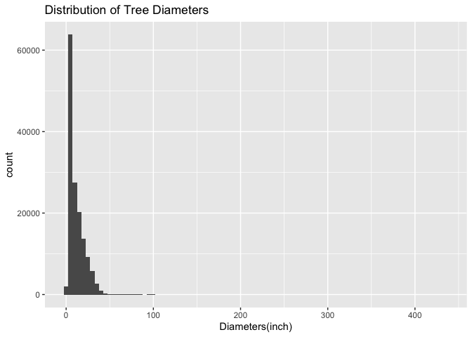<!-- -->

### 2. Create a new variable based on other variables in your data (only if it makes sense)

I use mutate to create a new variable “diameter_cm”, which converts the
unit of diameters to the metric system to make it easier to visualize
the difference and perform calculations.

``` r
vancouver_trees <- vancouver_trees %>%
  mutate(diameter_cm = diameter * 2.54)
head(vancouver_trees)
```

    ## # A tibble: 6 × 21
    ##   tree_id civic_number std_str…¹ genus…² speci…³ culti…⁴ commo…⁵ assig…⁶ root_…⁷
    ##     <dbl>        <dbl> <chr>     <chr>   <chr>   <chr>   <chr>   <chr>   <chr>  
    ## 1  149556          494 W 58TH AV ULMUS   AMERIC… BRANDON BRANDO… N       N      
    ## 2  149563          450 W 58TH AV ZELKOVA SERRATA <NA>    JAPANE… N       N      
    ## 3  149579         4994 WINDSOR … STYRAX  JAPONI… <NA>    JAPANE… N       N      
    ## 4  149590          858 E 39TH AV FRAXIN… AMERIC… AUTUMN… AUTUMN… Y       N      
    ## 5  149604         5032 WINDSOR … ACER    CAMPES… <NA>    HEDGE … N       N      
    ## 6  149616          585 W 61ST AV PYRUS   CALLER… CHANTI… CHANTI… N       N      
    ## # … with 12 more variables: plant_area <chr>, on_street_block <dbl>,
    ## #   on_street <chr>, neighbourhood_name <chr>, street_side_name <chr>,
    ## #   height_range_id <dbl>, diameter <dbl>, curb <chr>, date_planted <date>,
    ## #   longitude <dbl>, latitude <dbl>, diameter_cm <dbl>, and abbreviated
    ## #   variable names ¹​std_street, ²​genus_name, ³​species_name, ⁴​cultivar_name,
    ## #   ⁵​common_name, ⁶​assigned, ⁷​root_barrier

### 5. Filter observations in your data according to your own criteria. Think of what you’d like to explore - again, if this was the `titanic` dataset, I may want to narrow my search down to passengers born in a particular year…

By exploring the data, I realized there are almost 100 tree genera in
Vancouver. I will narrow down my analysis to 3 genus to make it easier
to analyze. I first choose the maple family(acer) because it is the most
popular tree in Canada. Then I randomly choose two other genera from the
data.

``` r
tree_narrow <- vancouver_trees %>%
  filter(genus_name %in% c("PYRUS","ACER","STYRAX"), diameter_cm != 0)
tree_narrow
```

    ## # A tibble: 39,892 × 21
    ##    tree_id civic_number std_st…¹ genus…² speci…³ culti…⁴ commo…⁵ assig…⁶ root_…⁷
    ##      <dbl>        <dbl> <chr>    <chr>   <chr>   <chr>   <chr>   <chr>   <chr>  
    ##  1  149579         4994 WINDSOR… STYRAX  JAPONI… <NA>    JAPANE… N       N      
    ##  2  149604         5032 WINDSOR… ACER    CAMPES… <NA>    HEDGE … N       N      
    ##  3  149616          585 W 61ST … PYRUS   CALLER… CHANTI… CHANTI… N       N      
    ##  4  149617         4909 SHERBRO… ACER    PLATAN… COLUMN… COLUMN… N       N      
    ##  5  149618         4925 SHERBRO… ACER    PLATAN… COLUMN… COLUMN… N       N      
    ##  6  149619         4969 SHERBRO… ACER    PLATAN… COLUMN… COLUMN… N       N      
    ##  7  149640         6968 SELKIRK… ACER    PLATAN… COLUMN… COLUMN… N       N      
    ##  8  149647          509 E 16TH … STYRAX  JAPONI… <NA>    JAPANE… N       N      
    ##  9  149658         5208 WINDSOR… STYRAX  JAPONI… <NA>    JAPANE… N       N      
    ## 10  149680         5311 WINDSOR… ACER    CAMPES… <NA>    HEDGE … N       N      
    ## # … with 39,882 more rows, 12 more variables: plant_area <chr>,
    ## #   on_street_block <dbl>, on_street <chr>, neighbourhood_name <chr>,
    ## #   street_side_name <chr>, height_range_id <dbl>, diameter <dbl>, curb <chr>,
    ## #   date_planted <date>, longitude <dbl>, latitude <dbl>, diameter_cm <dbl>,
    ## #   and abbreviated variable names ¹​std_street, ²​genus_name, ³​species_name,
    ## #   ⁴​cultivar_name, ⁵​common_name, ⁶​assigned, ⁷​root_barrier

### 6. Use a boxplot to look at the frequency of different observations within a single variable. You can do this for more than one variable if you wish!

The box plot showed the range of the three genera of tree. However, this
box plot is not clear enough since there are some extreme values. I will
filter out the outliers in further analysis.

``` r
tree_boxplot <- tree_narrow %>%
  ggplot(aes(x = genus_name, y = diameter_cm)) +
  geom_boxplot() +
  ggtitle("Boxplot of Diameter of Different Trees") +
  ylab("Diameters(inch)") + 
  xlab("Genus Name")
tree_boxplot
```

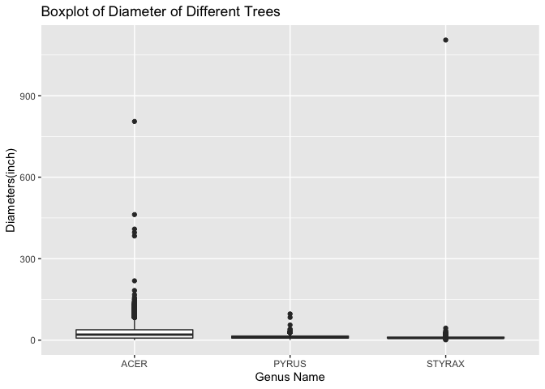<!-- -->

# Task 3: Write your research questions (5 points)

So far, you have chosen a dataset and gotten familiar with it through
exploring the data. Now it’s time to figure out 4 research questions
that you would like to answer with your data! Write the 4 questions and
any additional comments at the end of this deliverable. These questions
are not necessarily set in stone - TAs will review them and give you
feedback; therefore, you may choose to pursue them as they are for the
rest of the project, or make modifications!

1.  Does the genus of a tree affect the its diameter?
2.  Does the sampling distribution of sample means for the diameters of
    PYRUS trees have a similar mean of the population mean?
3.  What is the most planted tree (genus) in Vancouver?
4.  Do the outliers of diameters affect the summary statistics a lot?

# Task 4: Process and summarize your data (13 points)

From Task 2, you should have an idea of the basic structure of your
dataset (e.g. number of rows and columns, class types, etc.). Here, we
will start investigating your data more in-depth using various data
manipulation functions.

### 1.1 (10 points)

Now, for each of your four research questions, choose one task from
options 1-4 (summarizing), and one other task from 4-8 (graphing). You
should have 2 tasks done for each research question (8 total). Make sure
it makes sense to do them! (e.g. don’t use a numerical variables for a
task that needs a categorical variable.). Comment on why each task helps
(or doesn’t!) answer the corresponding research question.

Ensure that the output of each operation is printed!

**Summarizing:**

1.  Compute the *range*, *mean*, and *two other summary statistics* of
    **one numerical variable** across the groups of **one categorical
    variable** from your data.
2.  Compute the number of observations for at least one of your
    categorical variables. Do not use the function `table()`!
3.  Create a categorical variable with 3 or more groups from an existing
    numerical variable. You can use this new variable in the other
    tasks! *An example: age in years into “child, teen, adult, senior”.*
4.  Based on two categorical variables, calculate two summary statistics
    of your choosing.

**Graphing:**

5.  Create a graph out of summarized variables that has at least two
    geom layers.
6.  Create a graph of your choosing, make one of the axes logarithmic,
    and format the axes labels so that they are “pretty” or easier to
    read.
7.  Make a graph where it makes sense to customize the alpha
    transparency.
8.  Create 3 histograms out of summarized variables, with each histogram
    having different sized bins. Pick the “best” one and explain why it
    is the best.

Make sure it’s clear what research question you are doing each operation
for!

### Research Question 1: Does the genus of a tree affect the its diameter?

For research question 1, I compute the summary statistics by using the
summarize function. From the below table and graphs, tt can be concluded
that the average diameters are different for different genera of trees.
I also plot the histogram of different genera and add a red line to
indicate the mean of each genus. The visualization shows the difference
in a very clear manner.

``` r
# Summarizing option 1
tree_narrow_summary <- 
  tree_narrow %>%
  select(genus_name, diameter_cm) %>%
  group_by(genus_name) %>%
  summarize(mean_diam = mean(diameter_cm),
            median_diam = median(diameter_cm),
            sd_diam = sd(diameter_cm),
            range_diam = range(diameter_cm))
```

    ## `summarise()` has grouped output by 'genus_name'. You can override using the
    ## `.groups` argument.

``` r
tree_narrow_summary
```

    ## # A tibble: 6 × 5
    ## # Groups:   genus_name [3]
    ##   genus_name mean_diam median_diam sd_diam range_diam
    ##   <chr>          <dbl>       <dbl>   <dbl>      <dbl>
    ## 1 ACER            27.0       20.3    22.3       0.635
    ## 2 ACER            27.0       20.3    22.3     805.   
    ## 3 PYRUS           11.6       10.2     5.72      0.635
    ## 4 PYRUS           11.6       10.2     5.72     96.5  
    ## 5 STYRAX          10.5        7.62   27.5       1.27 
    ## 6 STYRAX          10.5        7.62   27.5    1105.

``` r
# Graphing option 5
tree_narrow_graph_acer<- 
  tree_narrow %>%
  select(genus_name, diameter_cm) %>%
  filter(genus_name == "ACER") %>%
  ggplot(aes(x = diameter_cm)) +
  geom_histogram(binwidth = 5, alpha = 0.7 ) +
  geom_vline(xintercept = 26.95362, color = "red") +
  ggtitle("Distribution of Diameters(cm) of Acer in Vanouuver")
tree_narrow_graph_acer
```

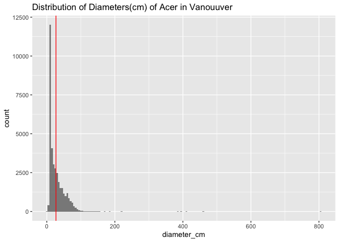<!-- -->

``` r
tree_narrow_graph_pyrus<- 
  tree_narrow %>%
  select(genus_name, diameter_cm) %>%
  filter(genus_name == "PYRUS") %>%
  ggplot(aes(x = diameter_cm)) +
  geom_histogram(binwidth = 3, alpha = 0.7 ) +
  geom_vline(xintercept = 11.64117, color = "red") +
  ggtitle("Distribution of Diameters(cm) of Pyrus in Vanouuver")
tree_narrow_graph_pyrus
```

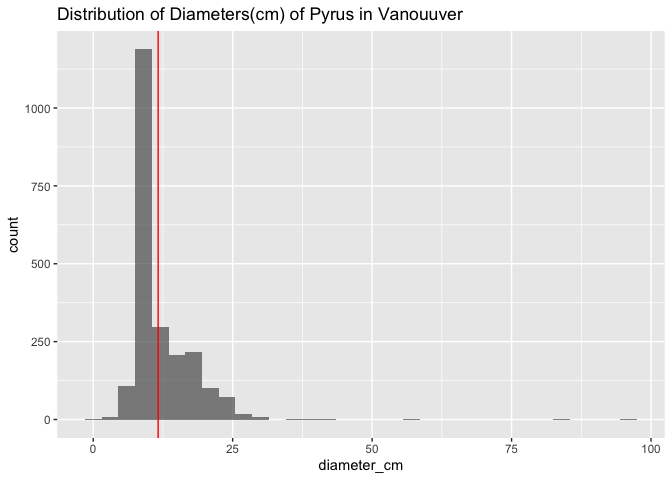<!-- -->

``` r
tree_narrow_graph_styrax<- 
  tree_narrow %>%
  select(genus_name, diameter_cm) %>%
  filter(genus_name == "STYRAX") %>%
  ggplot(aes(x = diameter_cm)) +
  geom_histogram(binwidth = 5, alpha = 0.7 ) +
  geom_vline(xintercept = 10.45542, color = "red") +
  ggtitle("Distribution of Diameters(cm) of Styrax in Vanouuver")
tree_narrow_graph_styrax
```

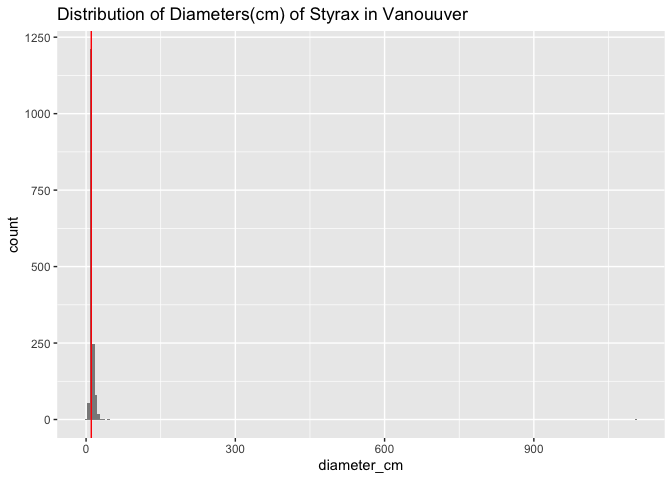<!-- -->

### Research Question 2: Does the sampling distribution of sample means for the diameters of PYRUS trees have a similar mean of the population mean?

For research question 2, I filter the dataset to select only trees of
genus Pyrus as an example. I generate the samples 1000 times and
calculate the the summary statistics of the sampling data. The sampling
statistics is close to the population statistics. I plot the sampling
distribution histogram three times with different bin widths. The bin
width = 0.1 is the best one since the difference between each
observation is very small. When we choose the bin width, we should
consider the differences and the range of the observations.

``` r
# Summarizing option 1
set.seed(999) #set seed to make the result reproducible
pyrus_tree <- 
  vancouver_trees %>%
  filter(genus_name == "PYRUS") %>%
  select(diameter_cm)
pyrus_sampling <- 
  pyrus_tree %>%
  rep_sample_n(size = 100, reps = 1000) %>%
  group_by(replicate) %>%
  summarize(sample_mean = mean(diameter_cm),
            sample_median = median(diameter_cm),
            sample_sd = sd(diameter_cm),
            sample_range = range(diameter_cm))
```

    ## `summarise()` has grouped output by 'replicate'. You can override using the
    ## `.groups` argument.

``` r
head(pyrus_sampling)
```

    ## # A tibble: 6 × 5
    ## # Groups:   replicate [3]
    ##   replicate sample_mean sample_median sample_sd sample_range
    ##       <int>       <dbl>         <dbl>     <dbl>        <dbl>
    ## 1         1        12.7         10.2       6.46         5.08
    ## 2         1        12.7         10.2       6.46        39.4 
    ## 3         2        11.3          9.84      4.69         6.35
    ## 4         2        11.3          9.84      4.69        24.1 
    ## 5         3        12.2         10.2       5.89         4.44
    ## 6         3        12.2         10.2       5.89        39.4

``` r
sampling_summary <- 
  pyrus_sampling %>%
  summarize(mean = mean(sample_mean),
            median = median(sample_median))
sampling_summary
```

    ## # A tibble: 1,000 × 3
    ##    replicate  mean median
    ##        <int> <dbl>  <dbl>
    ##  1         1  12.7  10.2 
    ##  2         2  11.3   9.84
    ##  3         3  12.2  10.2 
    ##  4         4  10.8   7.62
    ##  5         5  11.5   8.89
    ##  6         6  11.5  10.2 
    ##  7         7  11.6  10.2 
    ##  8         8  11.4  10.2 
    ##  9         9  11.5  10.2 
    ## 10        10  11.4   8.57
    ## # … with 990 more rows

``` r
# Graphing option 8
pyrus_sampling_dist_1 <-
  pyrus_sampling %>%
  ggplot(aes(x = sample_mean)) +
  geom_histogram(binwidth = 1) +
  geom_vline(xintercept = 11.61128, color = "red") +
  ggtitle("Sampling Distribution of Sample mean of Pyrus's Diameter(bin = 1)") +
  xlab("Sample Mean of Pyrus Diameter(cm)")
pyrus_sampling_dist_1
```

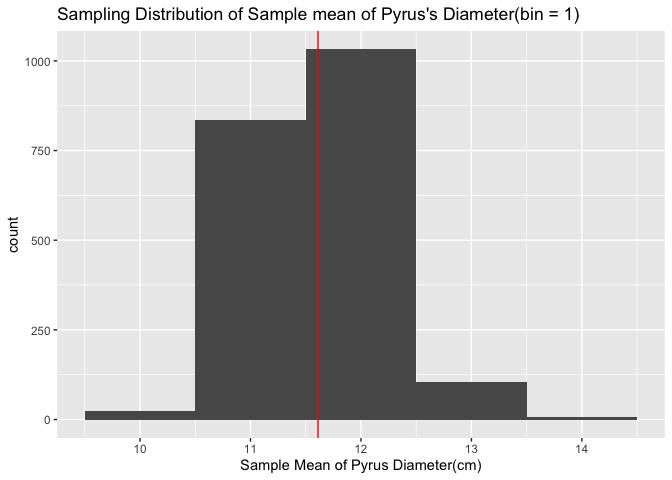<!-- -->

``` r
pyrus_sampling_dist_2 <-
  pyrus_sampling %>%
  ggplot(aes(x = sample_mean)) +
  geom_histogram(binwidth = 3) +
  geom_vline(xintercept = 11.61128, color = "red") +
  ggtitle("Sampling Distribution of Sample mean of Pyrus's Diameter(bin = 3)") +
  xlab("Sample Mean of Pyrus Diameter(cm)")
pyrus_sampling_dist_2
```

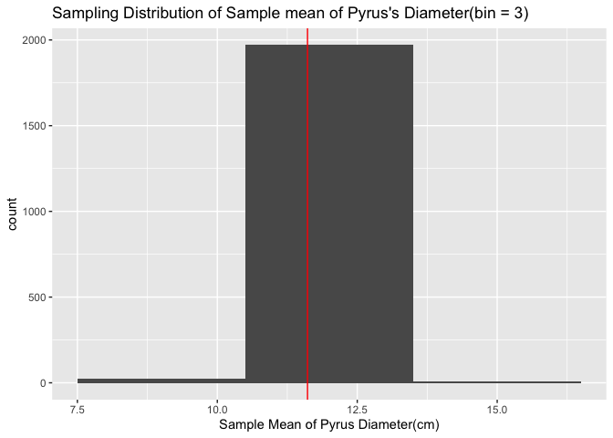<!-- -->

``` r
pyrus_sampling_dist_3 <-
  pyrus_sampling %>%
  ggplot(aes(x = sample_mean)) +
  geom_histogram(binwidth = 0.1) +
  geom_vline(xintercept = 11.61128, color = "red") +
  ggtitle("Sampling Distribution of Sample mean of Pyrus's Diameter(bin = 0.1)") +
  xlab("Sample Mean of Pyrus Diameter(cm)")
pyrus_sampling_dist_3
```

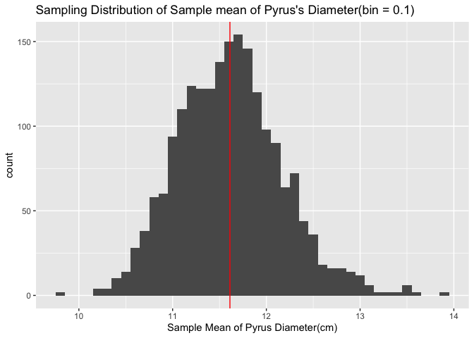<!-- -->

### Research Question 3: What is the most planted tree (genus) in Vancouver?

For research question 3, I use summarize to find the most planted tree
in Vancouver and arrange it in a descending order. There are 97 genera,
it is hard to plot them all in one graph, so I plot the genera with more
than 5000 trees planted. From the below graphs, the most planted genus
in Vancouver is Acer.

``` r
# Summarizing option 2

tree_obs <- vancouver_trees %>%
  group_by(genus_name) %>%
  summarize(count = n()) %>%
  arrange(desc(count))
tree_obs
```

    ## # A tibble: 97 × 2
    ##    genus_name count
    ##    <chr>      <int>
    ##  1 ACER       36062
    ##  2 PRUNUS     30683
    ##  3 FRAXINUS    7381
    ##  4 TILIA       6773
    ##  5 QUERCUS     6119
    ##  6 CARPINUS    5806
    ##  7 FAGUS       4808
    ##  8 MALUS       4173
    ##  9 MAGNOLIA    3899
    ## 10 CRATAEGUS   3864
    ## # … with 87 more rows

``` r
# Graphing option 5
# There is too much type of trees. So I only show the graph of most planted trees. 
tree_obs_graph <- 
  tree_obs %>%
  filter(count > 5000) %>%
  ggplot(aes(x = genus_name, y = count, fill = genus_name)) +
  geom_bar(stat = "identity") +
  geom_text(aes(label = count), vjust = 0) +
  ggtitle("Count for Most Planted Trees in Vancouver") +
  xlab("Genus Name")
  
tree_obs_graph
```

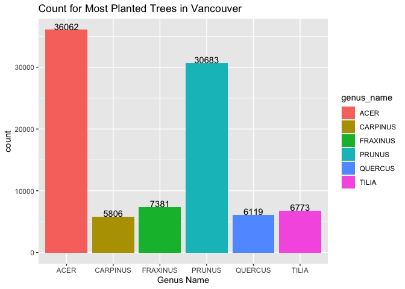<!-- -->

### Research Question 4: Do the outliers of diameters affect the summary statistics a lot?

For research question 4, I filter the diameter_cm \< 50 by looking at
the boxplot above. I only choose acer as an example because different
genera have different ranges and different kinds of outliers. Ignoring
the outliers affects our summary statistics a lot. Sd and mean are be
more affected than median because they are sensitive to extreme values.
Without the outliers, the graph is clearer compared to the graphs in
research question 1 and the boxplot in the previous section.

``` r
# Summarizing option 1

tree_narrow_nonoutlier <- 
  tree_narrow %>%
  filter(diameter_cm < 50, genus_name == "ACER")
tree_narrow_nooutlier_summary <- tree_narrow_nonoutlier %>%
  select(genus_name, diameter_cm) %>%
  group_by(genus_name) %>%
  summarize(mean_diam = mean(diameter_cm),
            median_diam = median(diameter_cm),
            sd_diam = sd(diameter_cm),
            range_diam = range(diameter_cm))
```

    ## `summarise()` has grouped output by 'genus_name'. You can override using the
    ## `.groups` argument.

``` r
tree_narrow_nooutlier_summary
```

    ## # A tibble: 2 × 5
    ## # Groups:   genus_name [1]
    ##   genus_name mean_diam median_diam sd_diam range_diam
    ##   <chr>          <dbl>       <dbl>   <dbl>      <dbl>
    ## 1 ACER            19.2        15.2    12.3      0.635
    ## 2 ACER            19.2        15.2    12.3     49.8

``` r
# Graphing option 5

tree_nonoutlier_acergraph<- 
  tree_narrow_nonoutlier %>%
  select(genus_name, diameter_cm) %>%
  ggplot(aes(x = diameter_cm)) +
  geom_histogram(binwidth = 5, alpha = 0.7 ) +
  geom_vline(xintercept = 26.95362, color = "red") +
  ggtitle("Distribution of Diameters(cm) of Acer in Vanouuver")
tree_nonoutlier_acergraph
```

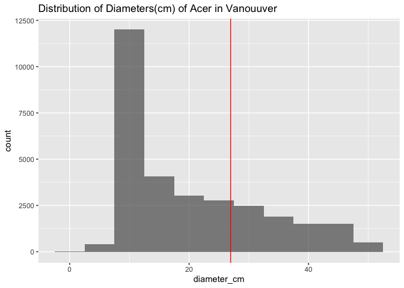<!-- -->

``` r
tree_boxplot_nonoutlier <- tree_narrow_nonoutlier %>%
  ggplot(aes(x = genus_name, y = diameter_cm)) +
  geom_boxplot() +
  ggtitle("Boxplot of Diameter of Different Trees") +
  ylab("Diameters(inch)") + 
  xlab("Genus Name")
tree_boxplot_nonoutlier
```

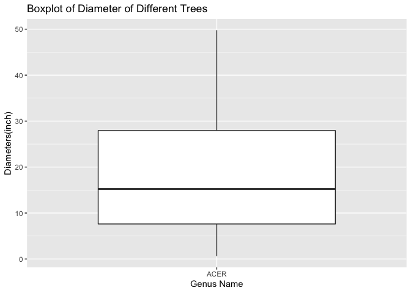<!-- -->

### 1.2 (3 points)

Based on the operations that you’ve completed, how much closer are you
to answering your research questions? Think about what aspects of your
research questions remain unclear. Can your research questions be
refined, now that you’ve investigated your data a bit more? Which
research questions are yielding interesting results?

<!-------------------------- Start your work below ---------------------------->

Based on the operations I have completed, I am able to answer all of my
research questions. However, it may be obvious that the diameters are
different for different genera. To extend my analysis, I could further
analyze the diameters of different tree cultivars within the same genus.
The research question 3 has an interesting result. The second most
planted trees in Vancouver are prunus.
<!----------------------------------------------------------------------------->

### Attribution

Thanks to Icíar Fernández Boyano for mostly putting this together, and
Vincenzo Coia for launching.
